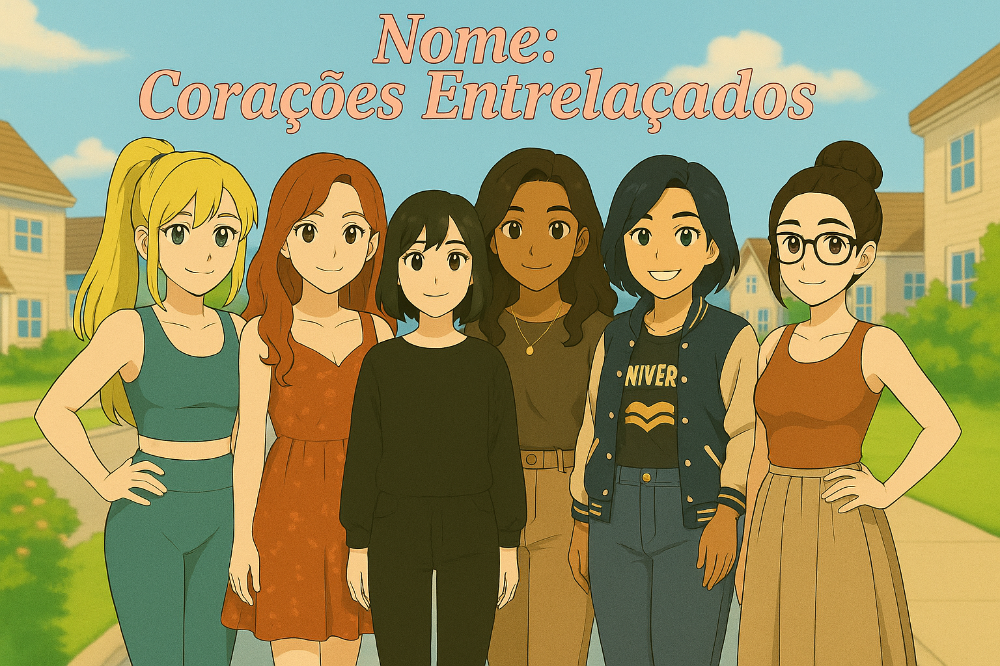

# NIME: University Connections



**A Heartfelt Visual Novel About Friendship, Growth, and Meaningful Connections**

---

## 📖 Sobre o Projeto

NIME é uma visual novel emocionante que explora a vida universitária através de conexões humanas autênticas. O jogo segue a jornada de um estudante recém-chegado à Faculdade Solária, onde cada escolha molda relacionamentos e descobertas pessoais.

### 🎯 Conceito Principal

O jogo celebra a diversidade humana e o poder das conexões genuínas, mostrando como pessoas com personalidades distintas podem se complementar e crescer juntas. Através de um sistema de exploração dinâmico, o jogador descobre diferentes áreas do campus e conhece personagens únicos, cada um com sua própria história e perspectiva de vida.

---

## 🎮 Características do Jogo

### 👥 Sistema de Personagens
- **6 personagens principais** com personalidades distintas e bem desenvolvidas
- **Sistema de afinidade** que rastreia relacionamentos
- **Crescimento de personagem** através de interações significativas
- **Memórias compartilhadas** que registram momentos especiais

### 🗺️ Sistema de Exploração
- **Campus dinâmico** com múltiplas áreas para explorar
- **Eventos únicos** em cada localização
- **Sistema de progressão** baseado em escolhas
- **Descoberta gradual** de personagens e histórias

### 💝 Sistema de Relacionamentos
- **Conexões futuras** que influenciam capítulos posteriores
- **Momentos emocionais** que aprofundam vínculos
- **Escolhas significativas** que impactam a narrativa
- **Múltiplos finais** baseados nas decisões do jogador

---

## 👥 Personagens

### 🌟 Nicole
- **Personalidade:** Metodista e analítica
- **Área de Estudo:** Comunicação estratégica e análise de dados
- **Características:** Organizada, precisa, valoriza estrutura e metodologia
- **Cor:** Rosa (#FF69B4)

### 🌿 Camille
- **Personalidade:** Espiritual e sábia
- **Área de Estudo:** Conexões energéticas e práticas de mindfulness
- **Características:** Serena, intuitiva, conectada com o universo
- **Cor:** Verde (#32CD32)

### 🎬 Katia
- **Personalidade:** Tsundere cinéfila
- **Área de Estudo:** Cinema e análise de narrativas
- **Características:** Intensa, apaixonada por cinema, analítica
- **Cor:** Roxo (#8A2BE2)

### 🎨 Huey (Aline)
- **Personalidade:** Artista sensível
- **Área de Estudo:** Artes visuais e expressão criativa
- **Características:** Contemplativa, criativa, vê beleza em tudo
- **Cor:** Ciano (#00CED1)

### 🎮 Samantha
- **Personalidade:** Nerd tímida e entusiasta de jogos
- **Área de Estudo:** Jogos e estratégia criativa
- **Características:** Tímida, apaixonada por RPG, criativa
- **Cor:** Laranja (#FF4500)

### ⚽ Larissa
- **Personalidade:** Esportiva competitiva
- **Área de Estudo:** Educação física e estratégia esportiva
- **Características:** Energética, competitiva, motivadora
- **Cor:** Dourado (#FFD700)

### 👨‍🏫 Professor Wendell
- **Função:** Mentor sábio e guia espiritual
- **Características:** Inspirador, sábio, conecta os estudantes
- **Cor:** Roxo escuro (#6202bbff)

---

## 🏗️ Estrutura do Projeto

### 📁 Organização de Arquivos

```
nime/
├── game/
│   ├── capitulos/           # Capítulos principais do jogo
│   │   ├── capitulo1.rpy    # Capítulo 1 - Primeiros encontros
│   │   ├── capitulo2.rpy    # Capítulo 2 - Aprofundamento
│   │   ├── capitulo3.rpy    # Capítulo 3 - Crescimento
│   │   ├── capitulo4.rpy    # Capítulo 4 - Desenvolvimento
│   │   ├── capitulo5.rpy    # Capítulo 5 - Desafios
│   │   ├── capitulo6.rpy    # Capítulo 6 - Descobertas
│   │   ├── capitulo7.rpy    # Capítulo 7 - Transformação
│   │   ├── capitulo8.rpy    # Capítulo 8 - Decisões
│   │   ├── capitulo9.rpy    # Capítulo 9 - Conclusões
│   │   ├── capitulo10.rpy   # Capítulo 10 - Finalizações
│   │   ├── final.rpy        # Final do jogo
│   │   └── ultima_atualizacao.rpy
│   │
│   ├── eventos/             # Eventos organizados por capítulo
│   │   ├── capitulo_1/      # Eventos do Capítulo 1
│   │   ├── capitulo_2/      # Eventos do Capítulo 2
│   │   ├── capitulo_3/      # Eventos do Capítulo 3
│   │   ├── capitulo_4/      # Eventos do Capítulo 4
│   │   └── capitulo_5/      # Eventos do Capítulo 5
│   │
│   ├── images/              # Recursos visuais
│   │   ├── characters/      # Sprites das personagens
│   │   └── cenarios/        # Backgrounds e cenários
│   │
│   ├── sounds/              # Efeitos sonoros
│   │   └── menu.mp3         # Música do menu principal
│   │
│   ├── music/               # Músicas de fundo
│   │   └── menu.mp3         # Música alternativa
│   │
│   ├── gui/                 # Interface do usuário
│   │   ├── button/          # Botões da interface
│   │   ├── bar/             # Barras de progresso
│   │   └── phone/           # Elementos do telefone
│   │
│   ├── tl/                  # Traduções
│   │   ├── pt/              # Português
│   │   └── en/              # Inglês
│   │
│   ├── personagens.rpy      # Definições das personagens
│   ├── scenarios.rpy        # Definições dos cenários
│   ├── music.rpy           # Definições de música
│   ├── sistemas_melhorados.rpy # Sistemas avançados
│   └── options.rpy         # Configurações do jogo
│
├── project.json            # Configurações do projeto
└── README.md              # Este arquivo
```

---

## 🎵 Sistema de Áudio

### 🎶 Músicas Disponíveis
- **Menu Principal:** `sounds/menu.mp3`
- **Ambiente do Campus:** `music/campus_ambient.ogg`
- **Biblioteca:** `music/library_ambient.ogg`
- **Cinema:** `music/cinema_ambient.ogg`
- **Quadra Esportiva:** `music/sports_ambient.ogg`
- **Festa:** `music/party.ogg`
- **Momentos Emocionais:** `music/happy_moment.ogg`, `music/sad_moment.ogg`
- **Temas das Personagens:** `music/nicole_theme.ogg`, `music/camille_theme.ogg`, etc.

### 🔊 Comandos de Áudio
```renpy
# Tocar música
play music campus_ambient fadein 2.0

# Parar música
stop music fadeout 3.0

# Tocar efeito sonoro
play sound "click.ogg"
```

---

## 🎮 Mecânicas de Jogo

### 🗺️ Sistema de Exploração
- **Exploração Livre:** Navegue pelo campus em diferentes momentos
- **Eventos Dinâmicos:** Cada área oferece eventos únicos
- **Progressão Temporal:** Diferentes momentos do dia desbloqueiam novos eventos
- **Sistema de Retorno:** Eventos completados são removidos do menu

### 💝 Sistema de Relacionamentos
- **Pontos de Afinidade:** Cada personagem tem um sistema de pontos
- **Memórias Compartilhadas:** Registro de momentos especiais
- **Crescimento de Personagem:** Desenvolvimento através de interações
- **Conexões Futuras:** Escolhas influenciam capítulos posteriores

### 🎯 Sistema de Escolhas
- **Escolhas Significativas:** Decisões que impactam a narrativa
- **Momentos Emocionais:** Cenas especiais que aprofundam relacionamentos
- **Múltiplos Caminhos:** Diferentes rotas baseadas nas escolhas
- **Sistema de Progressão:** Desbloqueio de conteúdo baseado em relacionamentos

---

## 🚀 Como Executar

### 📋 Pré-requisitos
- **Ren'Py 8.4.1** ou superior
- **Python 3.12** (incluído no Ren'Py)
- **Sistema Operacional:** Windows, macOS ou Linux

### 🛠️ Instalação
1. **Clone o repositório:**
   ```bash
   git clone https://github.com/seu-usuario/nime.git
   cd nime
   ```

2. **Abra o projeto no Ren'Py:**
   - Inicie o Ren'Py Launcher
   - Selecione "Open Project"
   - Navegue até a pasta `nime`

3. **Execute o jogo:**
   - Clique em "Launch Project"
   - O jogo será executado automaticamente

### 🎮 Controles
- **Mouse:** Navegação pela interface
- **Clique:** Avançar diálogos e fazer escolhas
- **Teclado:** Atalhos para menu e configurações
- **Scroll:** Navegar por menus longos

---

## 🎨 Desenvolvimento

### 🛠️ Tecnologias Utilizadas
- **Engine:** Ren'Py 8.4.1
- **Linguagem:** Python 3.12
- **Formato de Imagem:** PNG, JPG
- **Formato de Áudio:** MP3, OGG
- **Sistema de Arquivos:** Estrutura modular Ren'Py

### 📝 Convenções de Código
- **Personagens:** Definidos em `personagens.rpy`
- **Cenários:** Definidos em `scenarios.rpy`
- **Músicas:** Definidas em `music.rpy`
- **Eventos:** Organizados por capítulo em `eventos/`
- **Labels:** Nomenclatura clara e descritiva

### 🔧 Estrutura de Labels
```renpy
# Capítulos principais
label capitulo1:
    # Conteúdo do capítulo

# Eventos específicos
label evento_nicole_camille:
    # Conteúdo do evento

# Caminhadas especiais
label capitulo1_caminhada_nicole:
    # Conteúdo da caminhada
```

---

## 📊 Status do Projeto

### ✅ Implementado
- [x] Sistema de personagens completo
- [x] Capítulo 1 com exploração dinâmica
- [x] Sistema de relacionamentos
- [x] Sistema de áudio
- [x] Interface multilíngue (PT/EN)
- [x] Sistema de progressão
- [x] Eventos de primeiro encontro
- [x] Sistema de afinidade
- [x] Mecânicas de escolha

### 🚧 Em Desenvolvimento
- [ ] Capítulos 2-10
- [ ] Eventos adicionais
- [ ] Sistema de save/load
- [ ] Galeria de CG
- [ ] Sistema de conquistas

### 📋 Planejado
- [ ] Múltiplos finais
- [ ] DLCs de conteúdo
- [ ] Modding support
- [ ] Mobile version
- [ ] Console ports

---

## 🤝 Contribuição

### 📝 Como Contribuir
1. **Fork** o repositório
2. **Crie** uma branch para sua feature
3. **Commit** suas mudanças
4. **Push** para a branch
5. **Abra** um Pull Request

### 🐛 Reportar Bugs
- Use o sistema de Issues do GitHub
- Inclua informações detalhadas sobre o bug
- Anexe screenshots se necessário
- Especifique a versão do Ren'Py

### 💡 Sugestões
- Use o sistema de Discussions
- Descreva sua ideia detalhadamente
- Explique como isso melhoraria o jogo
- Considere a viabilidade técnica

---

## 📄 Licença

Este projeto está sob a licença MIT. Veja o arquivo `LICENSE` para mais detalhes.

---

## 👨‍💻 Desenvolvedor

**Yago Marialva**
- **GitHub:** [@seu-usuario](https://github.com/seu-usuario)
- **Email:** seu-email@exemplo.com
- **Itch.io:** [NIME Game Page](https://seu-usuario.itch.io/nime)

---

## 🙏 Agradecimentos

- **Ren'Py Community** - Pela engine incrível
- **Visual Novel Community** - Pelo suporte e inspiração
- **Testers** - Pelo feedback valioso
- **Artists** - Pelos recursos visuais
- **Musicians** - Pela trilha sonora

---

## 📞 Contato

Para dúvidas, sugestões ou parcerias:
- **Email:** contato@nime-game.com
- **Discord:** NIME Community
- **Twitter:** @NIMEGame
- **Instagram:** @nime_game

---

**NIME: University Connections** - Onde cada escolha importa e cada conexão transforma. 🎓✨

---

*Última atualização: Setembro 2025*